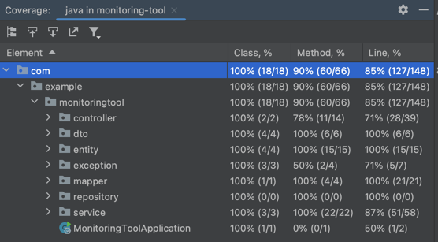

# Monitoring Tool Server - Backend

This repository contains the backend implementation of the Monitoring Tool, built with Spring Boot, Java, and Redis.

## Getting Started

1. Clone the repository:

    ```
    git clone https://github.com/davidlourenco6/monitoring-tool
    cd monitoring-tool
    ```

2. Set up Service Infrastructure:

   Use the following Docker Compose command to start the Mongo database:

    ```
    docker-compose up -d
    ```

3. Build the project:

    ```
    mvn clean package
    ```

4. Run tests (unit and int):

    ```
    mvn test
    ```

5. Run the application:

   When Docker image is running, start Spring Boot application with the following command or using IDE:

    ```
    mvn spring-boot:run
    ```

## Swagger API Documentation

Explore the API endpoints accessing recourses/apiDocs/docs.json:

[ApiDocs File](src/main/resources/apiDocs/docs.yaml)

## Postman Collection

To get started, follow these simple steps:

1. Install Postman: If you haven't already, download and install Postman.

2. Import Collection: Download the collection file (./postman/Monitoring Service.postman_collection.json) from this repository and import it into your Postman app.

3. Explore Endpoints: Start exploring CRUD endpoints available in the collection. Each request is thoroughly documented with descriptions, headers, and example payloads in openAPI.
   The collection is organized into different requests for functionality. Here's provided CRUD operations:


[Monitoring-Tool Collection](./postman/Monitoring Service.postman_collection.json)

## Code Coverage Evidences (run tests with coverage)


## Future Work (Improvements)

1. Alerting Mechanisms: Implement alerting mechanisms to automatically notify users via email, SMS, or other channels when a monitoring job detects an issue or when predefined thresholds are exceeded.
2. Real-Time Monitoring Dashboard: Develop a real-time monitoring dashboard that visualizes the status of all monitoring jobs.
3. Improve filtering and sorting. As example: getSuccessRateByUrl, getResultsByUrl, getStatusByUrl (success, errors)
4. Authentication and Authorization: Implement authentication and authorization mechanisms to secure your REST APIs. Using Spring Security per example.

---
